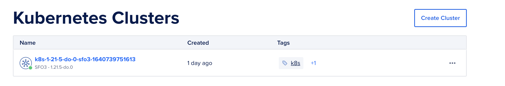
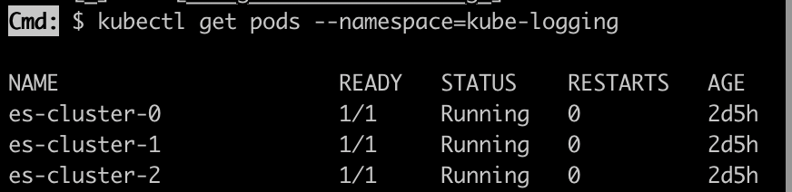
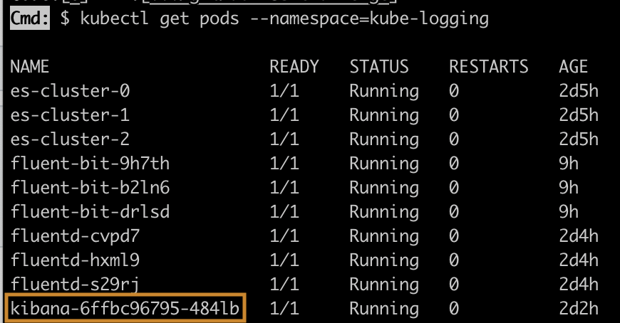
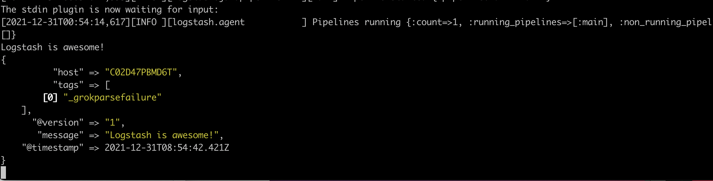
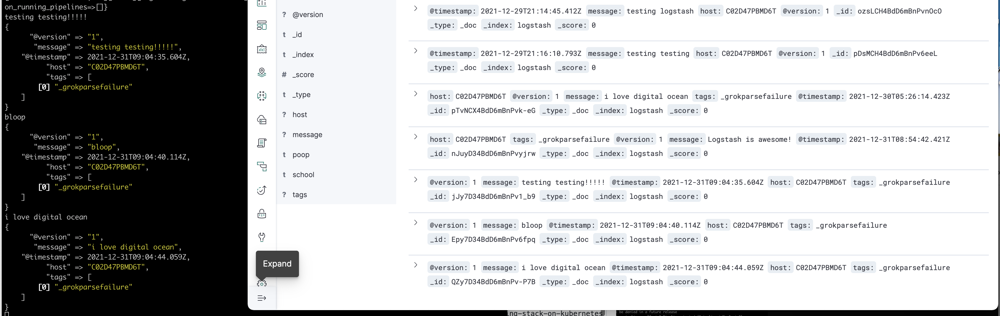

# Name of Project
I chose the following [Digital Ocean challenge](https://www.digitalocean.com/community/pages/kubernetes-challenge):

> Deploy a log monitoring system
So your applications produce logs. Lots of logs. How are you supposed to analyze them? A common solution is to aggregate and analyze them using the ELK stack, alongside fluentd or fluentbit.

# do-k8s-challenge 

First, I created a Kubernetes Cluster via [Digital Ocean's Control Panel](https://docs.digitalocean.com/products/kubernetes/how-to/create-clusters/).

Then, I download/connect to Kubernetes `brew install kubectl` and install doctl, the official CLI for Digital Ocean API. `brew install doctl`, then `doctl auth init`, which prompts you to authenticate doctl for use with your DigitalOcean account. Next, generate [Personal Access Token](https://cloud.digitalocean.com/account/api/tokens)

In order to use kubectl in any cirumstance, you must configure your cluster. In K8s, a `context` is used to group access parameters under a name. The configuration for every cluster will contain a stanza for contexts with cluster-specific values which look like this:

```
contexts:
- context:
    cluster: do-sfo2-example-cluster-01
    user: do-sfo2-example-cluster-01-admin
  name: do-sfo2-example-cluster-01
current-context: do-sfo2-example-cluster-01
```



`doctl kubernetes cluster kubeconfig save <your_cluster_name>` automatically adds your config file to `~/.kube/config`

```
Cmd: $ doctl kubernetes cluster kubeconfig save k8s-1-21-5-do-0-sfo3-1640339365671
Notice: Adding cluster credentials to kubeconfig file found in "/Users/CYip/.kube/config"
Notice: Setting current-context to do-sfo3-k8s-1-21-5-do-0-sfo3-1640339365671
```

Now you're all set to use kubectl!

Now onto the fun logging stuff! First, I created a namespace called `kube-logging`. Then, I create the ElasticSearch StatefulSet, which 
manages the deployment and scaling of a set of pods. Elasticsearch is defined as a `Service` here, in the `kube-logging` namespace we just created. 

```
kind: Namespace
apiVersion: v1
metadata:
  name: kube-logging
```

Next, we create an Elasticsearch Cluster. We defined it as a `Service` called `elastic-search` in the same Namespace we created above. Port 9200 is used for all API calls over HTTP. This includes search, aggregations, monitoring and anything else that uses a HTTP request. All client libraries will use this port to talk to Elasticsearch.
Port 9300 is a custom binary protocol used for communications between nodes in a cluster, like cluster updates, master elections, nodes joining/leaving, and shard allocation.

```
kind: Service
apiVersion: v1
metadata:
  name: elasticsearch
  namespace: kube-logging
  labels:
    app: elasticsearch
spec:
  selector:
    app: elasticsearch
  clusterIP: None
  ports:
    - port: 9200
      name: rest
    - port: 9300
      name: inter-node
```

We want to make this cluster a StatefulSet because it gives it stability and persistency in storage. This is where we also define the `replicas` to represent 3 pods.

```
apiVersion: apps/v1
kind: StatefulSet
metadata:
  name: es-cluster
  namespace: kube-logging
spec:
  serviceName: elasticsearch
  replicas: 3
  selector:
    matchLabels:
      app: elasticsearch
  template:
    metadata:
      labels:
        app: elasticsearch
    spec:
      containers:
      - name: elasticsearch
        image: docker.elastic.co/elasticsearch/elasticsearch:7.2.0
        resources:
            limits:
              cpu: 1000m
            requests:
              cpu: 100m
        ports:
        - containerPort: 9200
          name: rest
          protocol: TCP
        - containerPort: 9300
          name: inter-node
          protocol: TCP
        volumeMounts:
        - name: data
          mountPath: /usr/share/elasticsearch/data
        env:
          - name: cluster.name
            value: k8s-logs
          - name: node.name
            valueFrom:
              fieldRef:
                fieldPath: metadata.name
          - name: discovery.seed_hosts
            value: "es-cluster-0.elasticsearch,es-cluster-1.elasticsearch,es-cluster-2.elasticsearch"
          - name: cluster.initial_master_nodes
            value: "es-cluster-0,es-cluster-1,es-cluster-2"
          - name: ES_JAVA_OPTS
            value: "-Xms512m -Xmx512m"
      initContainers:
      - name: fix-permissions
        image: busybox
        command: ["sh", "-c", "chown -R 1000:1000 /usr/share/elasticsearch/data"]
        securityContext:
          privileged: true
        volumeMounts:
        - name: data
          mountPath: /usr/share/elasticsearch/data
      - name: increase-vm-max-map
        image: busybox
        command: ["sysctl", "-w", "vm.max_map_count=262144"]
        securityContext:
          privileged: true
      - name: increase-fd-ulimit
        image: busybox
        command: ["sh", "-c", "ulimit -n 65536"]
        securityContext:
          privileged: true
  volumeClaimTemplates:
  - metadata:
      name: data
      labels:
        app: elasticsearch
    spec:
      accessModes: [ "ReadWriteOnce" ]
      storageClassName: do-block-storage
      resources:
        requests:
          storage: 100Gi
```


Next, set up Kibana! Kibana is a visualization dashboard software for Elasticsearch. This is where we'll see the data come to play in their pretty dashboards! Kibana is defined as a `service` in the same namespace as Elastic Search above, `kube-logging`.

```
apiVersion: v1
kind: Service
metadata:
  name: kibana
  namespace: kube-logging
  labels:
    app: kibana
spec:
  ports:
  - port: 5601
  selector:
    app: kibana
---
apiVersion: apps/v1
kind: Deployment
metadata:
  name: kibana
  namespace: kube-logging
  labels:
    app: kibana
spec:
  replicas: 1
  selector:
    matchLabels:
      app: kibana
  template:
    metadata:
      labels:
        app: kibana
    spec:
      containers:
      - name: kibana
        image: docker.elastic.co/kibana/kibana:7.2.0
        resources:
          limits:
            cpu: 1000m
          requests:
            cpu: 100m
        env:
          - name: ELASTICSEARCH_URL
            value: http://elasticsearch:9200
        ports:
        - containerPort: 5601
        
```

 

Although the project I chose focused on the EFK Stack, I played around a bit with Logstash as well. Logstash is part of the Elastic Stack along with Beats, Elasticsearch and Kibana. It's a server-side data processing pipeline that ingests data from a multitude of sources simultaneously, transforms it, and then sends it to your favorite stash, for example, Elastic! 

Logstash has over 200 plugins, and you can write your own very easily as well. To begin with, I downloaded [Logstash] (https://www.elastic.co/downloads/logstash) and created a simple configuration file to grok logs and talk to Elastic Search, which lives on port 9200:

```
input { stdin { } }

filter {
  grok {
    match => { "message" => "%{COMBINEDAPACHELOG}" }
  }
  date {
    match => [ "timestamp" , "dd/MMM/yyyy:HH:mm:ss Z" ]
  }
}

output {
  elasticsearch { hosts => ["localhost:9200"] }
  stdout { codec => rubydebug }
}
```

With my Kibana pod and es-clusters still running, I run 
`kubectl port-forward kibana-6ffbc96795-484lb 5601:5601 --namespace=kube-logging`, `kubectl port-forward es-cluster-0 9200:9200 --namespace=kube-logging`
, `cd logstash`, `logstash -f logstash-simple.conf` 

Then I head over to `http://localhost:5601/` on my browser, which will eventually connect to Kibana. The "Discover" tab is where you'll be able to create index patterns for your logs. I named mine `logstash`.

Since I included `input { stdin { } }` in my logstash-simple.config file, this prompts me to type in an input to send logs up to Kibana: 





Hooray! That's my ELK stack! I also played around a bit with Fluentd, which is part of the EFK stack. 

This was a really fun project, and I can't wait to continue and enhance the logging (and play around with the visualization in Kibana!). Thanks Digital Ocean for this awesome opportunity to learn more about logging, k8s, and data visualization!


# Resources

- https://www.digitalocean.com/community/tutorials/how-to-set-up-an-elasticsearch-fluentd-and-kibana-efk-logging-stack-on-kubernetes
- https://dev.to/amitsaha/how-to-set-up-log-forwarding-in-a-kubernetes-cluster-using-fluent-bit-3bgk
